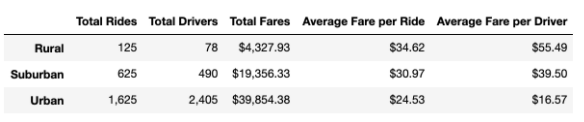
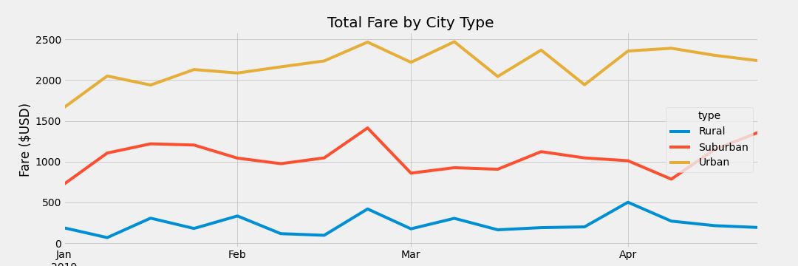

# PyBer_Analysis

## Overview
The purpose of this analysis is to create a summary dataframe of the ride-sharing data by city type that will then be visualized into a multiple-line graph that shows the total weekly fares for each city type. The graph will show how the data differs by city type and how those differences can be used by decision-makers at PyBer.

## Results
- Rural
The rural city type has the lowest total number of rides, drivers, and fare cost at 125 total rides, 78 total drivers, and $4.3k in total fares. The rural city type has the highest average fare per ride of $34.62 and average fare per driver of $55.49. 

- Suburban
The suburban city type has the second-most total number of rides, drivers, and fare cost at 625 total rides, 490 total drivers, and $19.3k in total fares. The suburban city type has an average fare per ride of $30.97 and average fare per driver of $39.50. 

- Urban
The urban city type has the highest total number of rides, drivers, and fare cost at 1,625 total rides, 2,405 total drivers, and $39.9k in total fares. The suburban city type has an average fare per ride of $24.53 and average fare per driver of $16.57. 

## Summary
Based on the results, the three business recommendations I would suggest to the CEO for addressing any disparities among city types are:
- The urban city type has more total drivers than total rides, whereas the rural and suburban city types have more total rides than total drivers. It seems that more drivers are going underutilized. I recommend that these drivers increase their rides, thereby increasing total fares and lowering the average fare per ride. 
- In April, it seems that the urban city type total fare increased before decreasing down to May, unlike the suburban and rural city types decreasing in April. I recommend increasing the number of rides in April in urban cities to maintain the total fares.
- I recommend increasing the total number of drivers in rural city types to decrease the average fare per driver.  
